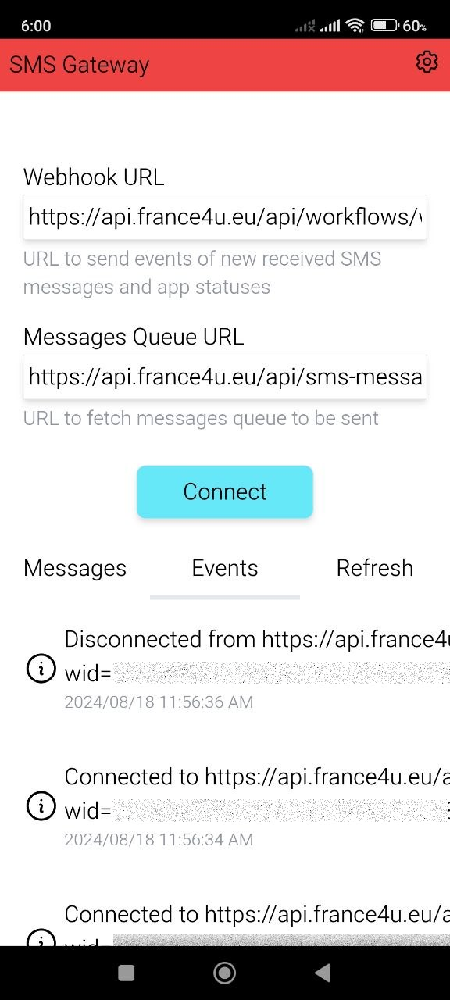
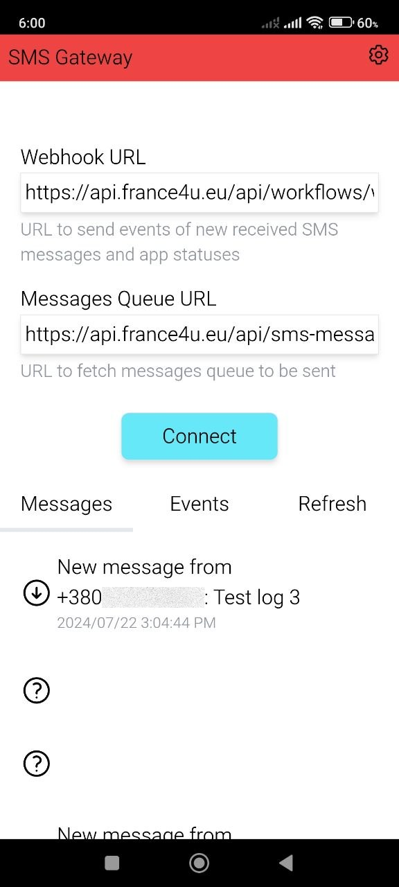
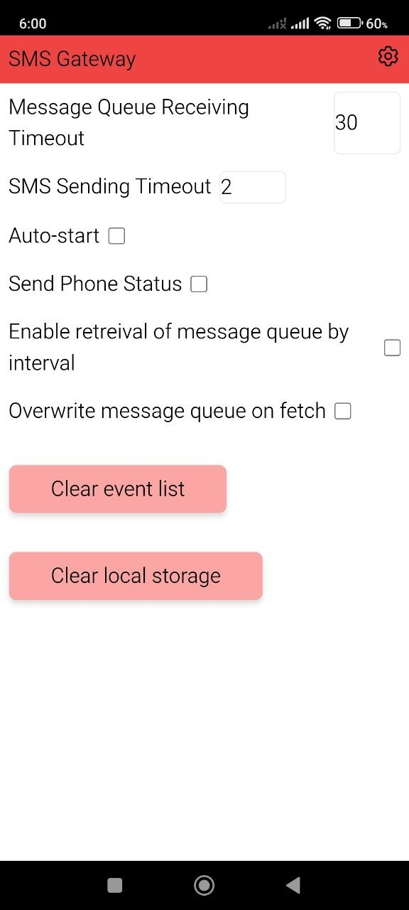
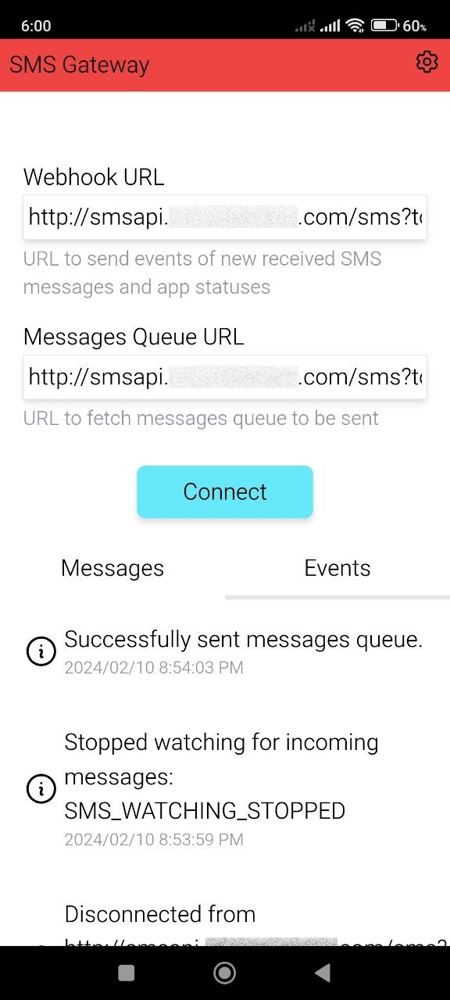
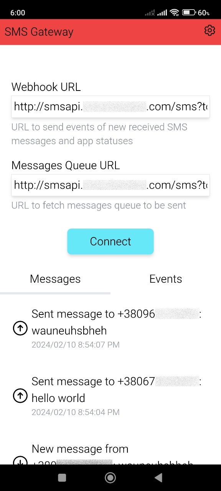
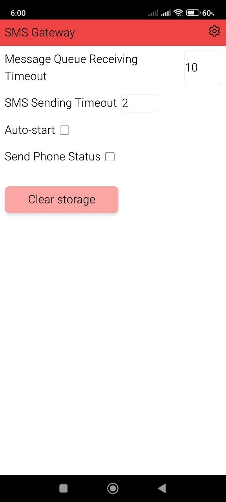

# smsg

 

_SMS Gateway for API_

this is an android app that turns your phone into an sms gateway. it allows you to send and receive sms messages using your own sim card by connecting the phone to your backend via webhooks and polling.

if you want to avoid the high costs or regional restrictions of services like **twilio**, you can install this app, keep the phone powered and connected, and use your local carrier plan to handle automated texts.

fun fact: at least 1-2 **real businesses** use this app!

---

**warning:** this code was actively developed in **2023-2024**. it is being pushed to github as-is. remember that mobile hardware and android sleep states can be finicky; you may need to dig into the code to handle specific quirks for your use case.

---

## screenshots

### version 2 (current)

| Events                            | Messages                          | Settings                          |
| --------------------------------- | --------------------------------- | --------------------------------- |
|  |  |  |

### version 1 (i didnt find the apk for this, sorry)

| Events                            | Messages                          | Settings                          |
| --------------------------------- | --------------------------------- | --------------------------------- |
|  |  |  |

## features

- bidirectional sms handling: incoming sms messages are forwarded to a custom webhook url and outgoing messages are fetched from a remote queue url.
- firebase integration: utilizes fcm tokens and `update_device_token` statuses to maintain a reliable link between your backend and the device.
- granular delivery reporting: tracks individual message success with `sms_sent` and validation errors like `err_invalid_number`.
- real-time monitoring: view color-coded event logs for system status and a dedicated message log history for sent and received texts.
- configurable gateway settings: adjust message queue and sending timeouts, toggle auto-start, and enable `connection_alive` heartbeats.
- local data persistence: configuration settings and logs are saved to the device local storage to persist between app sessions.
- connection management: includes a simple interface to connect or disconnect from services with built-in validation for required urls.

## usage

### 1. setup

install the app and navigate to the settings. you will need two main endpoints on your server:

1. **webhook url**: the app pushes incoming messages and status updates here.
2. **messages queue url**: the app polls this endpoint to find new messages to send.

### 2. receiving messages & statuses

the app sends `POST` requests to your webhook url. the payload always contains a `status` field.

**incoming sms payload (`SMS_RECEIVED`):**

```json
{
  "status": "SMS_RECEIVED",
  "message": "hello from the user",
  "sender": "+1234567890",
  "deviceId": "your-android-id"
}
```

### full status list:

- `CONNECTED`: gateway service started successfully.
- `DISCONNECTED`: gateway service stopped manually.
- `CONNECTION_FAILED`: firebase/fcm registration failed.
- `CONNECTION_ALIVE`: heartbeat sent during polling (if enabled in settings).
- `UPDATE_DEVICE_TOKEN`: sent when the fcm token is refreshed (save this to target the device via push).
- `MESSAGE_QUEUE_SENT`: sent after a batch of outgoing messages is processed.
- `SMS_SENT`: sent for each successful individual message handoff.
- `ERR_INVALID_NUMBER`: sent if the recipient number is missing the `+` prefix.

### 3. sending messages

the app utilizes **polling**. it will request your **messages queue url** and expects a `messages` array in return (it can be empty but it must be there).

**expected response from your server:**

```json
{
  "messages": [
    {
      "id": "msg_001",
      "recipient": "+1234567890",
      "message": "automated reply",
      "data": "optional-metadata"
    }
  ]
}
```

## configuration

you can tweak these in the settings tab:

- **polling intervals**: how often the app checks for new messages.
- **sending timeouts**: delay between messages to stay safe with carrier anti-spam filters.
- **auto-start**: start the service immediately on app launch.
- **phone status**: toggle whether to send the `CONNECTION_ALIVE` heartbeat.

## quirks & troubleshooting

- **do not let the phone sleep**: android is aggressive about killing background tasks. you must disable battery optimization for this app and ideally keep the device plugged into a power source.
- **sim card limits**: be mindful of your carrier's daily sms limits to avoid having your sim card blocked.
- **underground rocks**: there may be legacy issues or unhandled exceptions in certain android versions. read the logs in the app for debugging, or attach ADB and use devtools like i sometimes did during development.
- also, no, i will not upload this to google play. i initially thought to do that once i finished developing this, but it's been such a long time that there's no reason to do that anymore. this was very interesting to develop, though, as this project is likely my first real usage of java code, and an android app using capacitorjs.
- there also used to be an older version, before the revamp in 2024, but i didnt find the apk for it. you may try to build it yourself from the oldest commits in this git repository, but idk.

## license

MIT
